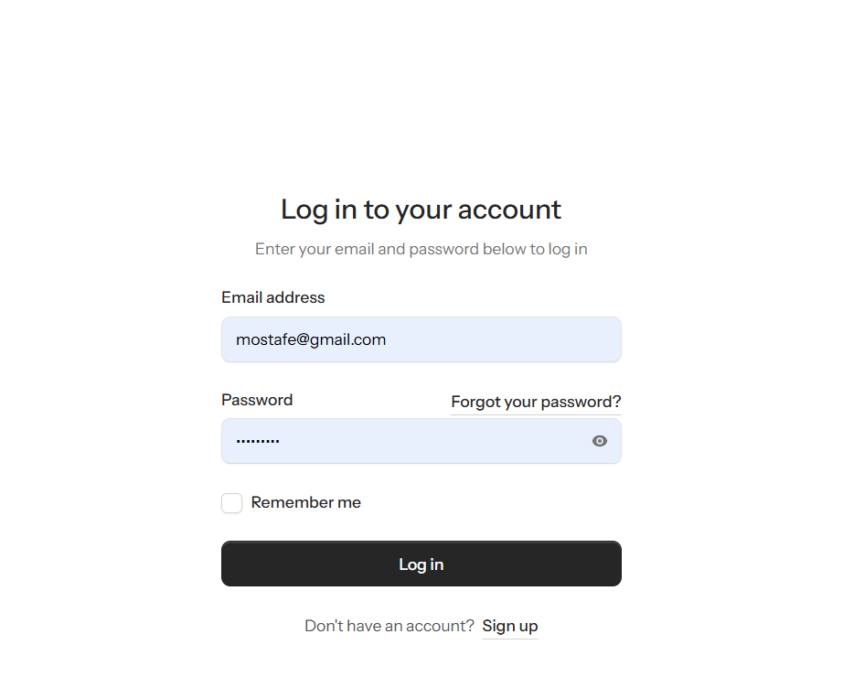
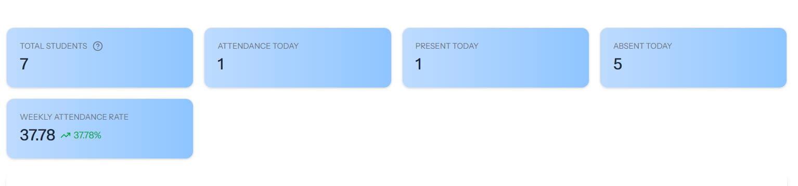

# Student Attendance Tracking System

A comprehensive web application for managing and tracking student attendance in educational institutions. Built with Laravel 12 and Livewire 2, this system provides role-based access control, automated reporting, and real-time attendance tracking.

## 🎯 Features

### Attendance Management
- **Daily Attendance Recording**: Quickly mark student attendance with multiple status options (present, absent, sick, other)
- **Attendance Notes**: Add categorized notes (medical, behavioral, general) for absences
- **Bulk Operations**: Mark all students as present/absent in a single action
- **Monthly Calendar View**: Interactive calendar interface for easy navigation and data entry

### Student Management
- **Student Registration**: Add new students with comprehensive information (name, age, gender, grade, photo)
- **Profile Management**: Edit student information and manage active/inactive status
- **Student Directory**: View complete student list with filtering by grade
- **Student Profiles**: Detailed student records with attendance history and statistics

### Reporting & Analytics
- **Monthly Attendance Reports**: Generate detailed reports showing attendance statistics per student
- **Attendance Percentage Calculation**: Automatic calculation of attendance rates
- **PDF Export**: Download formatted attendance reports as PDF documents
- **Excel Export**: Export attendance data to Excel spreadsheets for further analysis
- **Automated Email Reports**: Schedule and send attendance reports via email

### User Management & Security
- **Role-Based Access Control**: Separate dashboards for administrators and teachers
- **Two-Factor Authentication**: Enhanced security with 2FA support
- **Email Verification**: Verify user email addresses during registration
- **Password Management**: Secure password reset and change functionality
- **Profile Settings**: Customize user preferences and appearance settings

### Admin Dashboard
- **System Overview**: View key statistics and metrics
- **User Management**: Manage system users and their roles
- **Grade Management**: Create and manage grade levels
- **Full System Control**: Access to all administrative functions

### Teacher Dashboard
- **Quick Statistics**: View attendance overview at a glance
- **Student Search**: Quickly find and access student information
- **Recent Activity**: See latest attendance updates
- **Attendance Management**: Access attendance recording interface

## 🛠️ Tech Stack

### Backend
- **Framework**: Laravel 12
- **Language**: PHP 8.2+
- **Real-time Components**: Livewire 2.9.0
- **Authentication**: Laravel Fortify 1.30
- **UI Components**: Flux 2.9.0
- **PDF Generation**: DomPDF 3.1
- **Excel Export**: Maatwebsite Excel 3.1
- **Notifications**: Laravel Toaster 2.8

### Frontend
- **Template Engine**: Blade
- **Styling**: Tailwind CSS
- **Interactivity**: Alpine.js + Livewire
- **Icons**: Flux Icons

### Database
- **Support**: SQLite (development), MySQL/PostgreSQL (production)
- **Migrations**: Laravel Migrations
- **Seeders**: Database Seeders for sample data
- **Factories**: Model Factories for testing

## 🧪 Testing

Basic project structure supports automated testing using Pest.
(Test cases are planned to be added in future iterations.)

## 📋 Requirements

- PHP 8.2 or higher
- Composer
- Node.js 16+ and npm
- MySQL 5.7+ or SQLite
- Git

## 📸 Screenshots

### 🔐 Authentication
Login screen with role-based access (Admin / Teacher).


---

### 📊 Dashboard Overview
Key statistics cards and weekly attendance rate visualization.



---

### 🗓 Attendance Management
Daily attendance management with status and note types.


---

### 📈 Monthly Attendance Reports
Detailed monthly attendance summary with PDF export.


---

### 📉 Monthly Attendance Trends
Visual chart displaying attendance trends throughout the month.


---

### 👨‍🎓 Students Management
Students list with search, status, and actions.


---

### ➕ Add Student
Create a new student with photo upload and grade assignment.


---

### ⚙️ User Settings
Profile management and account settings.


## 🚀 Installation

### 1. Clone the Repository
```bash
git clone https://github.com/AmrElnaggarDev/student_attendance_tracking_app.git
cd student_attendance_tracking_app
```

### 2. Install Dependencies
```bash
composer install
npm install
```

### 3. Environment Setup
```bash
cp .env.example .env
php artisan key:generate
```

### 4. Database Configuration
Update your `.env` file with database credentials:
```env
DB_CONNECTION=mysql
DB_HOST=127.0.0.1
DB_PORT=3306
DB_DATABASE=attendance_app
DB_USERNAME=root
DB_PASSWORD=
```

### 5. Run Migrations & Seeders
```bash
php artisan migrate
php artisan db:seed
```

### 6. Build Frontend Assets
```bash
npm run build
```

### 7. Start Development Server
```bash
php artisan serve
```

Visit `http://localhost:8000` in your browser.

## 🔐 Default Credentials

After running seeders, use these credentials to login:

**Admin Account**
- Email: admin@example.com
- Password: password

**Teacher Account**
- Email: teacher@example.com
- Password: password

> ⚠️ **Important**: Change these credentials immediately in production!

## 📁 Project Structure

```
student_attendance_tracking_app/
├── app/
│   ├── Http/
│   │   ├── Middleware/          # Role-based middleware
│   │   └── Controllers/         # API controllers (if applicable)
│   ├── Livewire/                # Livewire components
│   │   ├── Admin/               # Admin dashboard components
│   │   ├── Teacher/             # Teacher dashboard components
│   │   └── Settings/            # User settings components
│   ├── Models/                  # Eloquent models
│   ├── Exports/                 # Excel export classes
│   └── Mail/                    # Email classes
├── database/
│   ├── migrations/              # Database migrations
│   ├── seeders/                 # Database seeders
│   └── factories/               # Model factories
├── resources/
│   ├── views/
│   │   ├── livewire/            # Livewire component views
│   │   ├── mail/                # Email templates
│   │   ├── pdf/                 # PDF templates
│   │   └── components/          # Reusable components
│   ├── css/                     # Stylesheets
│   └── js/                      # JavaScript files
├── routes/
│   └── web.php                  # Web routes
├── storage/                     # File storage
├── tests/                       # Test files
└── public/                      # Public assets
```

## 🔑 Key Endpoints

### Authentication Routes
- `GET /` - Welcome page
- `POST /login` - User login
- `POST /register` - User registration
- `POST /logout` - User logout

### Teacher Routes (Authenticated)
- `GET /dashboard` - Teacher dashboard
- `GET /attendance` - Attendance recording page
- `GET /student/profile/{student}` - Student profile view
- `GET /settings/*` - User settings

### Admin Routes (Admin Only)
- `GET /admin/dashboard` - Admin dashboard
- `GET /student-list` - Student management
- `GET /create/student` - Add new student
- `GET /edit/student/{id}` - Edit student
- `GET /grade/list` - Grade management
- `GET /teacher/reports/monthly-attendance` - Attendance reports


## 📊 Database Schema

### Key Tables

**users** - System users (admins, teachers)
- id, name, email, password, role, grade_id, two_factor_secret, timestamps

**students** - Student records
- id, first_name, last_name, age, gender, grade_id, is_active, photo_path, timestamps

**attendances** - Attendance records
- id, student_id, grade_id, date, status, reason, note_type, timestamps

**grades** - Grade levels
- id, name, timestamps

**subjects** - Subject/Course information
- id, name, timestamps

## 🔒 Security Features

- **CSRF Protection**: All forms protected with CSRF tokens
- **SQL Injection Prevention**: Using Eloquent ORM and parameterized queries
- **Password Hashing**: Bcrypt password hashing
- **Two-Factor Authentication**: Optional 2FA for enhanced security
- **Email Verification**: Email verification on registration
- **Role-Based Access Control**: Middleware-based authorization
- **Rate Limiting**: Built-in rate limiting on authentication routes

## 🚀 Deployment

### Using Laravel Sail (Docker)
```bash
./vendor/bin/sail up -d
./vendor/bin/sail artisan migrate
```

### Traditional Server
1. Set up PHP 8.2+ with necessary extensions
2. Configure web server (Apache/Nginx)
3. Set up MySQL/PostgreSQL database
4. Run migrations: `php artisan migrate --force`
5. Set up cron job for scheduled tasks: `* * * * * cd /path/to/app && php artisan schedule:run >> /dev/null 2>&1`

### Environment Variables for Production
```env
APP_ENV=production
APP_DEBUG=false
APP_URL=https://your-domain.com

DB_CONNECTION=mysql
DB_HOST=your-db-host
DB_DATABASE=your-db-name
DB_USERNAME=your-db-user
DB_PASSWORD=your-db-password

MAIL_DRIVER=smtp
MAIL_HOST=your-mail-host
MAIL_PORT=587
MAIL_USERNAME=your-email
MAIL_PASSWORD=your-password
```

## 📝 Usage Examples

### Recording Attendance
1. Navigate to `/attendance`
2. Select year, month, and grade
3. Click on student cells to toggle attendance status
4. Add notes if needed
5. Changes are saved automatically

### Generating Reports
1. Go to `/teacher/reports/monthly-attendance`
2. Select desired year, month, and grade
3. Click "Export PDF" or "Export Excel"
4. Download will start automatically

### Managing Students
1. Navigate to `/student-list` (Admin only)
2. Click "Add Student" to create new record
3. Fill in student information and upload photo
4. Click "Save" to create student

## 🐛 Troubleshooting

### Database Connection Error
- Verify database credentials in `.env`
- Ensure database server is running
- Check database name exists

### Permission Denied Errors
```bash
chmod -R 775 storage bootstrap/cache
```

### Missing Dependencies
```bash
composer install
npm install
php artisan vendor:publish
```

## 🤝 Contributing

Contributions are welcome! Please follow these steps:

1. Fork the repository
2. Create a feature branch (`git checkout -b feature/AmazingFeature`)
3. Commit changes (`git commit -m 'Add AmazingFeature'`)
4. Push to branch (`git push origin feature/AmazingFeature`)
5. Open a Pull Request

## 📄 License

This project is licensed under the MIT License - see the LICENSE file for details.

## 👨‍💻 Author

**Amr Elnaggar**
- GitHub: [@AmrElnaggarDev](https://github.com/AmrElnaggarDev)

## 🙏 Acknowledgments

- Laravel community for excellent documentation
- Livewire for making real-time components easy
- Tailwind CSS for beautiful styling
- All contributors and supporters

## 📞 Support

For issues and questions:
- Open an issue on GitHub
- Check existing documentation
- Review test files for usage examples


**Last Updated**: January 2026
**Version**: 1.0.0
